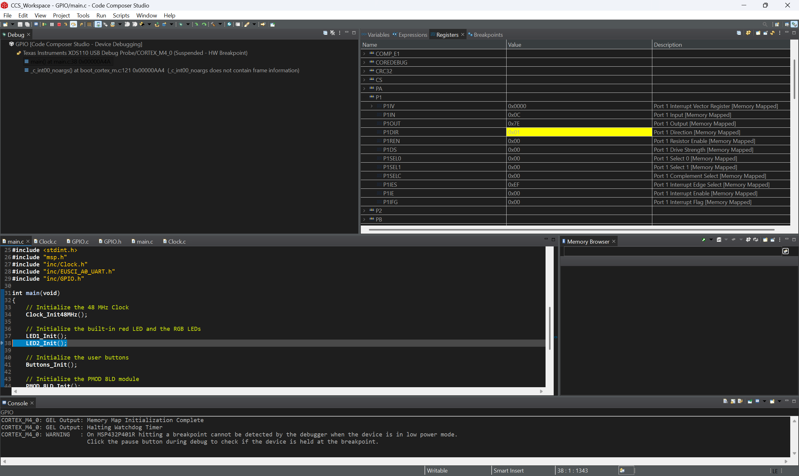
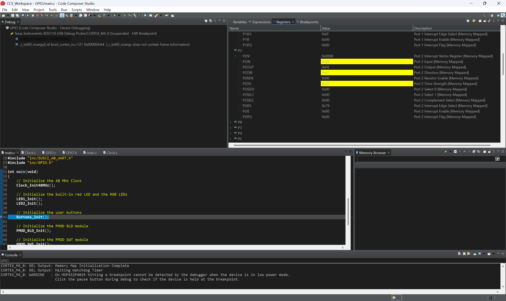
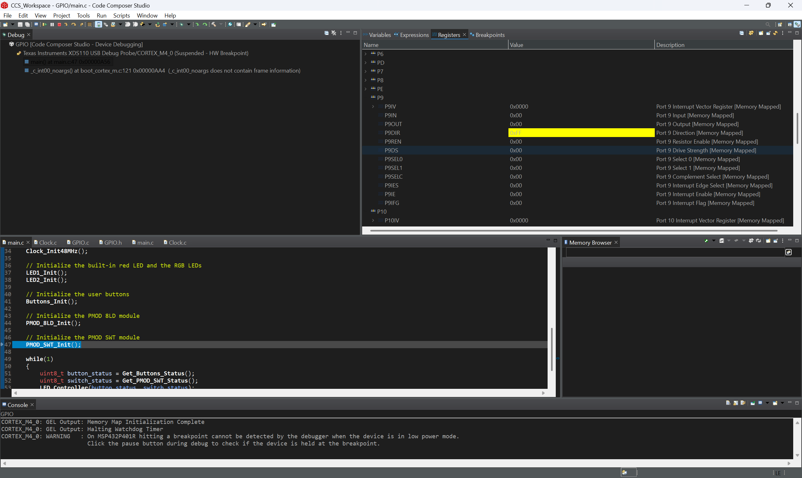
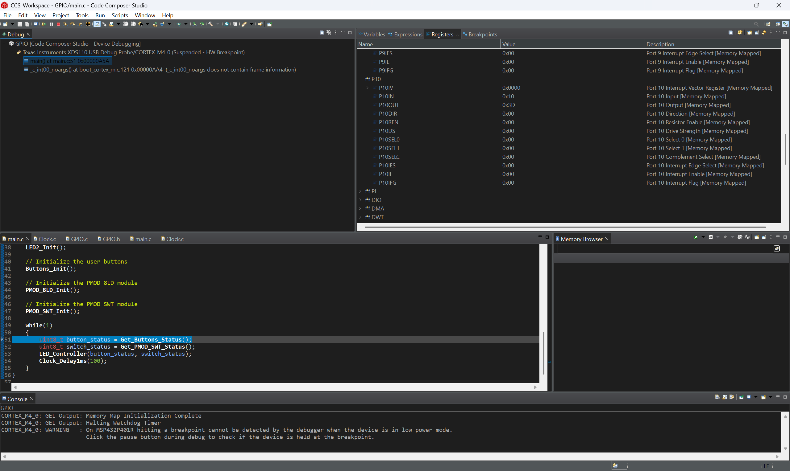

# ECE 528/L - Robotics and Embedded Systems Lab
**CSU Northridge**

**Department of Electrical and Computer Engineering**

## Lab 0 Report: General Purpose Input Output (GPIO)

The GPIO lab interfaces with the following:

* User buttons and LEDs of the TI MSP432 LaunchPad
* PMOD SWT (4 Slide Switches) - [Product Link](https://digilent.com/reference/pmod/pmodswt/start)
* PMOD 8LD (8 LEDs) - [Product Link](https://digilent.com/shop/pmod-8ld-eight-high-brightness-leds/)

---

## 1. Introduction

This lab introduces the General-Purpose Input/Output (GPIO) interface of the MSP432P401R LaunchPad. The built-in user buttons (S1, S2) are read as inputs, and the built-in red LED and RGB LED are driven as outputs. Two external Digilent modules, the PMOD SWT (four slide switches) and the PMOD 8LD (eight LEDs), are connected to the LaunchPad header pins. The switches select one of several LED patterns, which are shown on the PMOD 8LD and the on-board LEDs. The memory-mapped port registers were also inspected in the Code Composer Studio (CCS) debugger to confirm that each initialization function configured the pins correctly.

## 2. Objectives

1. Review the fundamentals of C programming (bitwise operations, structures and pointers, loops, and `switch` statements)
2. Configure the I/O ports on the MSP432 LaunchPad through the `SELx`, `DIR`, `REN`, `OUT`, and `DS` registers
3. Interact with the built-in user buttons and LEDs on the MSP432 LaunchPad
4. Connect the PMOD 8LD and PMOD SWT to the I/O ports
5. Create LED patterns based on the states of the buttons and switches
6. Analyze the I/O ports by viewing the memory-mapped registers in the debugger

## 3. Required Components

| Description              | Quantity | Manufacturer      |
|--------------------------|:--------:|-------------------|
| MSP432 LaunchPad         | 1        | Texas Instruments |
| USB-A to Micro-USB Cable | 1        | N/A               |
| PMOD 8LD                 | 1        | Digilent          |
| PMOD SWT                 | 1        | Digilent          |

## 4. Background

### 4.1 Pinout

| Device            | Pin(s)        | Direction | Notes                                            |
|-------------------|---------------|-----------|--------------------------------------------------|
| LED1 (red)        | P1.0          | Output    |                                                  |
| RGB LED (R, G, B) | P2.0 - P2.2   | Output    | High drive strength enabled                      |
| Button S1         | P1.1          | Input     | Active low, internal pull-up                     |
| Button S2         | P1.4          | Input     | Active low, internal pull-up                     |
| PMOD 8LD LED0-7   | P9.0 - P9.7   | Output    | Pins 5/11 to GND, pins 6/12 to 3.3 V             |
| PMOD SWT SWT1-4   | P10.0 - P10.3 | Input     | Pin 5 to GND, pin 6 to 3.3 V                     |

### 4.2 Register Configuration

Each port has memory-mapped registers that are accessed through the `msp.h` structures (for example, `P1->DIR`). In each register, bit *n* corresponds to pin *Px.n*.

| Register      | Purpose                                                                  |
|---------------|--------------------------------------------------------------------------|
| `SEL0`/`SEL1` | Select the pin function. Clearing both bits selects GPIO mode.           |
| `DIR`         | Set the pin direction: `1` is output, `0` is input.                      |
| `REN`         | Enable the internal pull-up or pull-down resistor on an input pin.       |
| `OUT`         | Drive an output pin. With `REN` set, `1` selects pull-up and `0` pull-down. |
| `IN`          | Read the current logic level of the pin.                                 |
| `DS`          | Select high drive strength (supported on specific pins only).            |

Bits are set with `|=` and cleared with `&= ~mask`, which leaves the other pins on the port unchanged. For example, LED1 is set up as an output with:

```c
P1->SEL0 &= ~0x01;  
P1->SEL1 &= ~0x01;
P1->DIR |=  0x01;  
```

The user buttons are set up as inputs with pull-up resistors. When a button is pressed, it connects the pin to GND and the pin reads `0` (negative logic):

```c
P1->SEL0 &= ~0x12;
P1->SEL1 &= ~0x12;
P1->REN |=  0x12;   
P1->OUT |=  0x12;  
```

## 5. Procedure

1. Forked and cloned the GPIO lab repository, then imported the CCS project.
2. Connected the PMOD SWT to P10.0 - P10.3 and the PMOD 8LD to P9.0 - P9.7 with the board powered off. Then connected GND and 3.3 V.
3. Connected the LaunchPad over USB and confirmed the Application/User UART COM port settings.
4. Built the project, loaded `GPIO.out`, and checked the default I/O behavior against the test cases in the lab manual.
5. Started a debug session and used **Step Over** past each initialization function to record the port register values. The screenshots are saved in `Figures/`.
6. Completed the tasks in Section 7 and checked each one on the hardware.

## 6. Results: Register Analysis

| Screenshot Step                   | Register | Value  | Explanation |
|-----------------------------------|----------|--------|-------------|
| After `LED1_Init()`               | P1DIR    | `0x01` | Bit 0 is set, so P1.0 (LED1) is an output. |
| After `LED2_Init()`               | P2DIR    | `0x07` | Bits 0-2 are set, so P2.0 - P2.2 (RGB LED) are outputs. |
| After `LED2_Init()`               | P2DS     | `0x07` | High drive strength is enabled on the three RGB LED pins. |
| After `PMOD_8LD_Init()`           | P9DIR    | `0xFF` | All eight pins of Port 9 are outputs for the PMOD 8LD. |
| After `PMOD_SWT_Init()`           | P10DIR   | `0x00` | Unchanged from the reset value, because P10.0 - P10.3 are inputs. |

`PMOD_8LD_Init()` also writes `P9->DS |= 0xFF`, but P9DS still read `0x00` in the debugger. On the MSP432P401R, high drive strength is only available on a few pins (P2.0 - P2.3), so writes to the `DS` bits of Port 9 have no effect.

**Port 1: after `LED1_Init()`**


**Port 2: after `LED2_Init()`**


**Port 9: after `PMOD_8LD_Init()`**


**Port 10: after `PMOD_SWT_Init()`**


## 7. Tasks

In the main loop, `main.c` reads the button and switch states every 100 ms and passes them to `LED_Controller()`. `LED_Controller()` uses the switch value to choose a pattern:

| Switch Status | Switches Enabled | Function Called                  |
|:-------------:|------------------|----------------------------------|
| `0x00`        | None             | `LED_Pattern_1(button_status)`   |
| `0x01`        | SWT1             | `LED_Pattern_2()`                |
| `0x02`        | SWT2             | `LED_Pattern_3()`                |
| `0x04`        | SWT3             | `LED_Pattern_4()`                |
| `0x08`        | SWT4             | `LED_Pattern_5()`                |
| `0x03`        | SWT1 + SWT2      | `Johnson_Counter()`              |
| Other         | Any other combination | `LED_Pattern_1(button_status)` |

Each sequence pattern reads `Get_PMOD_SWT_Status()` after every step and exits as soon as the switch value no longer matches its case. Control then returns to `LED_Controller()`, which selects the pattern for the new switch setting.

### Task 1: Modified `LED_Pattern_1`

The button status is `P1->IN & 0x12`. Because the buttons are active low, a `0` bit means the button is pressed.

| Test Case | Input | `button_status` | LED 1 | RGB LED | PMOD 8LD |
|:-:|---|:-:|---|---|---|
| 0 | Button 1 pressed | `0x10` | ON | OFF | `0x55` (LEDs 0, 2, 4, 6 ON) |
| 1 | Button 2 pressed | `0x02` | OFF | BLUE | `0xAA` (LEDs 1, 3, 5, 7 ON) |
| 2 | Both buttons pressed | `0x00` | Toggles | GREEN, toggles | All OFF |
| 3 | Neither button pressed | `0x12` | OFF | OFF | All OFF |

To make the even and odd LED patterns easier to read, the constants `PMOD_8LD_EVEN_ON` (`0x55`) and `PMOD_8LD_ODD_ON` (`0xAA`) were added. In test case 2, LED1 and the RGB LED turn on together and then off together, using `Clock_Delay1ms()` for the timing.

### Task 2: `LED_Pattern_3`: 8-bit binary down counter (SWT2)

This pattern turns on LED1, sets the RGB LED to blue, and counts from 255 down to 0 on the PMOD 8LD with a 100 ms delay between counts. It stops early if the switch value changes from `0x02`.

### Task 3: `LED_Pattern_4`: ring counter, shifting left (SWT3)

This pattern outputs `0x01 << i` for `i = 0 ... 7`, which gives the sequence 1, 2, 4, 8, 16, 32, 64, 128. The delay is 200 ms per step. It stops early if the switch value changes from `0x04`.

### Task 4: `LED_Pattern_5`: ring counter, shifting right (SWT4)

This pattern outputs `0x01 << i` for `i = 7 ... 0`, which gives the sequence 128, 64, 32, 16, 8, 4, 2, 1. The delay is 200 ms per step. It stops early if the switch value changes from `0x08`.

### Task 5: `Johnson_Counter`: 8-bit twisted ring counter (SWT1 + SWT2)

The counter starts at `0000_0000`. On each step, it shifts the value left by one bit and inserts the inverted previous MSB into bit 0:

```c
led_count = (led_count << 1) | ((led_count >> 7) ^ 1);
```

An *n*-bit Johnson counter has 2*n* states, so 16 iterations cover the full cycle: `0000_0001, 0000_0011, ... 1111_1111, 1111_1110, ... 1000_0000, 0000_0000`. The delay is 200 ms per step. The counter stops early if the switch value changes from `0x03`. Because `led_count` is a `uint8_t`, the bit shifted out of position 7 is dropped when the result is stored.

## 8. Conclusion

This lab showed how to configure MSP432 GPIO pins through the memory-mapped port registers:

* `SEL0`/`SEL1` select the GPIO function.
* `DIR` sets the direction.
* `REN`/`OUT` enable pull-up resistors on inputs.
* `DS` enables high drive strength.

The debugger register values matched the expected configuration for Ports 1, 2, 9, and 10. They also showed that high drive strength works only on the pins that support it. Masking with `&` and `|` let each function change only its own pins without affecting other devices on the same port. The on-board buttons and the PMOD SWT were then used to select counter patterns (binary up/down, ring, and Johnson) on the PMOD 8LD.

## 9. Resources

1. [MSP432P401R SimpleLink Microcontroller LaunchPad Development Kit User's Guide](https://docs.rs-online.com/3934/A700000006811369.pdf)
2. MSP432P401R Datasheet
3. Robot Systems Learning Kit (TI-RSLK) User Guide
4. MSP432P4xx SimpleLink Microcontrollers Technical Reference Manual
5. [PMOD SWT Reference Manual](https://digilent.com/reference/pmod/pmodswt/reference-manual)
6. [PMOD 8LD Reference Manual](https://digilent.com/reference/pmod/pmod8ld/reference-manual)
